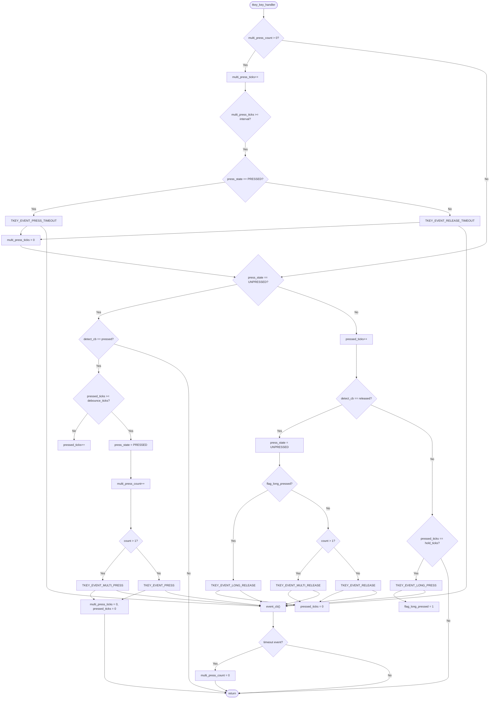

# tickey——跨平台按键检测库
## 特性
- 丰富的按键事件模型，支持短按、长按、双击、连击、释放等状态
- 基于tick的扫描机制，无延时函数，逻辑稳定，行为可预测
- 自动管理按键链表，按键数量无限制
- 软件与硬件解耦，通过回调函数关联硬件实现跨平台
- 事件回调驱动，应用层与底层扫描逻辑解耦
## 移植
- **tickey**采用纯C语言设计，将`tickey.c`和`tickey.h`添加到项目中即可
- 按键实例的创建默认使用C语言标准库的`malloc`函数，如有特殊的内存分配需求，可以将头文件中`tkey_malloc`和`tkey_free`宏替换为项目中所使用的内存分配函数
## 注意事项
- 不能在中断中调用`tkey_delete`函数，会有`Use-After-Free`风险
- 可以在event回调中调用`tkey_delete`函数
- `tkey_delete`仅释放内存，不会设置句柄为NULL，请手动设置
## 核心原理
### **tkey_key_handler**函数执行流程图

## 使用步骤
### 第一步 创建按键实例
创建一个按键实例并初始化，可以选择创建`默认按键`实例或者`自定义按键`实例
#### 创建默认按键实例
```c
tkey_handle_t key = tkey_create_default(tkey_event_cb, tkey_detect_cb, user_data);
```
默认按键实例的属性如下:
- **按键扫描处理函数的工作频率**:`100Hz`
- **去抖时间**:`1 tick` (20ms@100Hz)
- **长按时间**:`50 tick` (500ms@100Hz)
- **连续按下时间间隔**:`30 tick` (300ms@100Hz)
#### 创建自定义按键实例
```c
tkey_config_t tkey_config = 
{
    event_cb = tkey_event_cb,
    detect_cb = tkey_detect_cb,
    user_data = user_data,
    hold_ticks = 50,
    debounce_ticks = 1,
    multi_press_interval_ticks = 30,
};

tkey_handle_t key = tkey_create(&tkey_config);
```
`tkey_config`结构体参数如下:
- **event_cb**:事件回调函数
- **detect_cb**:检测回调函数
- **user_data**:传入回调函数的用户数据
- **hold_ticks**:长按持续时间
- **debounce_ticks**:去抖时间
- **multi_press_interval_ticks**:连续按下间隔时间
### 第二步 设置按键参数并使能按键的事件处理
创建按键实例时会传入按键的参数，后续也可以使用单独的设置函数来设置这些参数，实际的参数以最后设置的为准
```c
// 注册回调函数，只有按键没有使能时才能注册
void tkey_register_callback(tkey_handle_t key, tkey_event_cb_t event_cb, tkey_detect_cb_t detect_cb, void *user_data);
```
```c
// 设置按键的长按触发阈值
void tkey_set_hold(tkey_handle_t key, uint16_t hold_ticks);
```
```c
// 设置按键的去抖时间
void tkey_set_debounce(tkey_handle_t key, uint16_t debounce_ticks);
```
```c
// 设置按键多次按下检测的最大间隔时间
void tkey_set_multi_press_interval(tkey_handle_t key, uint16_t multi_press_interval_ticks);
```
设置好按键的参数后需要使能按键
```c
tkey_enable(key);
```
`tkey_enable`函数会检查按键实例的检测回调和事件回调是否为空，不为空则将按键实例添加到全局链表中<br>
该函数执行过程中会通过`flag_critical`标志禁用`tkey_handler`函数功能，这可能导致按键检测的丢失，影响检测的精度，尽管影响非常小但仍建议在使能所有按键后再周期性调用`tkey_handler`函数
### 第三步 编写回调函数
#### 检测回调函数
```c
int tkey_detect_cb(void *user_data)
{
    if(gpio_read((int)user_data) == 0) // 0:按下时电平为低电平 1:按下时电平为高电平
        return 1; // 检测到按下返回1
    else
        return 0; // 检测到释放返回0
}
```
可以在注册回调函数时通过`user_data`传入需要检测的引脚，这样可以将这个检测回调函数注册到不同的按键实例中
#### 事件回调函数
所有的按键事件如下:
- **TKEY_EVENT_NULL**:空事件
- **TKEY_EVENT_PRESS**:按键按下时的事件
- **TKEY_EVENT_RELEASE**:按键释放时的事件
- **TKEY_EVENT_LONG_PRESS**:判定为长按时的事件
- **TKEY_EVENT_LONG_RELEASE**:按键长按后释放时的事件
- **TKEY_EVENT_MULTI_PRESS**:判定为多次按下时的事件
- **TKEY_EVENT_MULTI_RELEASE**:按键多次按下后释放时的事件
- **TKEY_EVENT_PRESS_TIMEOUT**:按键在按下状态下多次按下检测超时的事件
- **TKEY_EVENT_RELEASE_TIMEOUT**:按键在释放状态下多次按下检测超时的事件
- **TKEY_EVENT_ALL_PRESS**:所有按下的事件，包括按下、长按和多次按下
- **TKEY_EVENT_ALL_RELEASE**:所有释放的事件，包括释放、长按后释放、多次按下后释放
- **TKEY_EVENT_DEFAULT_PRESS**:默认的按键按下事件，包括按下和多次按下
- **TKEY_EVENT_DEFAULT_RELEASE**:默认的按键释放事件，包括释放、长按后释放、多次按下后释放

不同的事件可以通过`|`与操作来完成多状态检测
```c
void tkey_event_cb(tkey_handle_t key, tkey_event_t event, uint8_t multi_press_count, void *user_data);
```
事件回调函数的参数如下:
- **key**:按键实例句柄
- **event**:事件
- **multi_press_count**:多次按下的次数
- **user_data**:用户数据
##### 例子1：默认按键事件检测
```c
void tkey_event_cb(tkey_handle_t key, tkey_event_t event, uint8_t multi_press_count, void *user_data)
{
    if(event & TKEY_EVENT_DEFAULT_PRESS)
        printf("key pressed %d times\r\n", multi_press_count);
    else if(event & TKEY_EVENT_DEFAULT_RELEASE)
        printf("key released\r\n");
}
```
默认按下事件包括`按下事件(TKEY_EVENT_PRESS)`和`多次按下事件(TKEY_EVENT_MULTI_PRESS)`，不包括`长按事件(TKEY_EVENT_LONG_PRESS)`，如果包括长按事件会导致在长按时先触发按下事件再触发长按事件，从而导致一次长按却触发两次回调函数<br>
默认释放事件包括`释放事件(TKEY_EVENT_RELEASE)`、`长按后释放事件(TKEY_EVENT_LONG_RELEASE)`、`多次按下后释放事件(TKEY_EVENT_MULTI_RELEASE)`，只在按键释放时触发回调函数
##### 例子2：多个按键实例共用一个事件回调函数
```c
tkey_handle_t key1, key2;

void tkey_event_cb(tkey_handle_t key, tkey_event_t event, uint8_t multi_press_count, void *user_data)
{
    switch(key)
    {
        case key1:
        if(event & TKEY_EVENT_DEFAULT_PRESS)
            printf("key1 pressed %d times\r\n", multi_press_count);
        break;
        case key2:
        if(event & TKEY_EVENT_DEFAULT_PRESS)
            printf("key2 pressed %d times\r\n", multi_press_count);
        break;
    }
}

key1 = tkey_create_default(tkey_event_cb, tkey_detect_cb, NULL);
key2 = tkey_create_default(tkey_event_cb, tkey_detect_cb, NULL);
```
多个按键可以共用一个事件回调函数，他们之间通过`tkey_handle_t key`参数进行区分，如果`user_data`表示按键的检测引脚，也可以使用`user_data`来区分，这样可以不用保存按键实例的句柄
```c
void tkey_event_cb(tkey_handle_t key, tkey_event_t event, uint8_t multi_press_count, void *user_data)
{
    switch((int)user_data) // user_data传入的是按键的检测引脚
    {
        case pin1:
        if(event & TKEY_EVENT_DEFAULT_PRESS)
            printf("key1 pressed %d times\r\n", multi_press_count);
        break;
        case pin2:
        if(event & TKEY_EVENT_DEFAULT_PRESS)
            printf("key2 pressed %d times\r\n", multi_press_count);
        break;
    }
}

tkey_create_default(tkey_event_cb, tkey_detect_cb, (void*)pin1);
tkey_create_default(tkey_event_cb, tkey_detect_cb, (void*)pin2);
```
##### 例子3：按下和长按共存
`长按事件(TKEY_EVENT_LONG_PRESS)`的触发时刻是在长按时间达到阈值的时刻，为了避免在长按事件触发前先触发`按下事件(TKEY_EVENT_PRESS)`，应当以`释放按键事件(TKEY_EVENT_RELEASE)`来区分按下和长按
```c
void tkey_event_cb(tkey_handle_t key, tkey_event_t event, uint8_t multi_press_count, void *user_data)
{
    if(event & TKEY_EVENT_RELEASE) // 按下事件
        printf("key pressed once\r\n");
    else if(event & TKEY_EVENT_LONG_PRESS) // 长按事件
        printf("key long pressed\r\n");
}
```
##### 例子4：按下和多次按下共存
```c
void tkey_event_cb(tkey_handle_t key, tkey_event_t event, uint8_t multi_press_count, void *user_data)
{
    if(event & TKEY_EVENT_RELEASE_TIMEOUT)
    {
        switch(multi_press_count)
        {
            case 1:printf("single click\r\n");break; // 单击
            case 2:printf("double click\r\n");break; // 双击
            case 3:printf("triple click\r\n");break; // 三击
        }
    }
}
```
为避免在`多次按下事件(TKEY_EVENT_MULTI_PRESS)`触发前先触发一次`按下事件(TKEY_EVENT_PRESS)`，通过多次按下检测结束后的`超时事件`延迟判定是一次按下还是多次按下，超时事件的发生表明多次按下的判定已经结束，多次按下的次数将重新计数
- **TKEY_EVENT_PRESS_TIMEOUT**:按键按下后到下一次按下的时间超过`多次按下检测的最大间隔时间(multi_press_interval_ticks)`，触发该事件时按键为按下状态
- **TKEY_EVENT_RELEASE_TIMEOUT**:按键按下后到下一次按下的时间超过`多次按下检测的最大间隔时间(multi_press_interval_ticks)`，触发该事件时按键为释放状态

延迟判定会导致事件回调函数延迟`multi_press_interval_ticks`时间后执行
##### 例子5：按下、多次按下、长按共存
结合[例子3](#例子3按下和长按共存)和[例子4](#例子4按下和多次按下共存)可以得出区分按下、多次按下、长按的事件回调函数
```c
void tkey_event_cb(tkey_handle_t key, tkey_event_t event, uint8_t multi_press_count, void *user_data)
{
    if(event & TKEY_EVENT_LONG_PRESS) // 长按事件
        printf("long pressed\r\n");
    else if(event & TKEY_EVENT_RELEASE_TIMEOUT)
    {
        switch(multi_press_count)
        {
            case 1:printf("single click\r\n");break; // 单击
            case 2:printf("double click\r\n");break; // 双击
            case 3:printf("triple click\r\n");break; // 三击
        }
    }
}
```
在上面的事件回调中，多次按下按键后保持按下状态到长按事件触发时不会触发多次按下事件，如果需要触发多次按下事件，则需要添加对`TKEY_EVENT_PRESS_TIMEOUT`事件的处理
```c
void tkey_event_cb(tkey_handle_t key, tkey_event_t event, uint8_t multi_press_count, void *user_data)
{
    if(event & TKEY_EVENT_LONG_PRESS) // 长按事件
        printf("long pressed\r\n");
    else if(event & TKEY_EVENT_RELEASE_TIMEOUT)
    {
        switch(multi_press_count)
        {
            case 1:printf("single click triggered by release timeout\r\n");break; // 单击
            case 2:printf("double click triggered by release timeout\r\n");break; // 双击
            case 3:printf("triple click triggered by release timeout\r\n");break; // 三击
        }
    }
    else if(event & TKEY_EVENT_PRESS_TIMEOUT)
    {
        switch(multi_press_count)
        {
            case 2:printf("double click triggered by press timeout\r\n");break; // 双击
            case 3:printf("triple click triggered by press timeout\r\n");break; // 三击
        }
    }
}
```
### 第四步 周期性调用处理程序
```c
void timer_callback(void) // 定时器回调
{
    tkey_handler();
}
```
初始化完成后需要周期性地调用`tkey_handler`函数处理按键的事件，`tkey_handler`函数会处理所有在全局链表中的按键实例<br>
也可以简单地使用循环和延时周期性地调用，但检测精度会降低
```c
while(1)
{
    tkey_handler();
    delay_ms(10);
}
```
### 第五步 禁用按键和资源释放
```c
tkey_disable(key);
```
如果需要临时禁用按键的功能可以调用`tkey_disable`函数，该函数会从全局链表中移除按键实例<br>
该函数执行过程中会通过`flag_critical`标志禁用`tkey_handler`函数功能，这可能导致按键检测的丢失，影响检测的精度，但影响非常小
```c
tkey_delete(key);
```
`tkey_delete`函数可以删除按键实例，释放按键的所有资源，只有未使能的按键实例才能删除
### 第六步 开始享受tickey吧！
### 完整代码
```c
#define press_level 0
#define key1_pin 1
#define key2_pin 2

int tkey_detect_cb(void *user_data)
{
    if(gpio_read((int)user_data) == press_level) // 0:按下时电平为低电平 1:按下时电平为高电平
        return 1; // 检测到按下返回1
    else
        return 0; // 检测到释放返回0
}

void tkey_event_cb(tkey_handle_t key, tkey_event_t event, uint8_t multi_press_count, void *user_data)
{
    switch((int)user_data)
    {
        case key1_pin:
        if(event & TKEY_EVENT_LONG_PRESS) // 长按事件
            printf("key1 long pressed\r\n");
        else if(event & TKEY_EVENT_RELEASE_TIMEOUT)
        {
            switch(multi_press_count)
            {
                case 1:printf("key1 single click\r\n");break; // 单击
                case 2:printf("key1 double click\r\n");break; // 双击
                case 3:printf("key1 triple click\r\n");break; // 三击
            }
        }
        break;
        case key2_pin:
        if(event & TKEY_EVENT_LONG_PRESS) // 长按事件
            printf("key2 long pressed\r\n");
        else if(event & TKEY_EVENT_RELEASE_TIMEOUT)
        {
            switch(multi_press_count)
            {
                case 1:printf("key2 single click\r\n");break; // 单击
                case 2:printf("key2 double click\r\n");break; // 双击
                case 3:printf("key2 triple click\r\n");break; // 三击
            }
        }
        break;
    }
}

void key_init(void)
{
    // (添加引脚和定时器的初始化代码)
    tkey_enable(tkey_create_default(tkey_event_cb, tkey_detect_cb, (void*)key1_pin));
    tkey_enable(tkey_create_default(tkey_event_cb, tkey_detect_cb, (void*)key2_pin));
}

void timer_callback(void) // 定时器回调
{
    tkey_handler();
}
```
